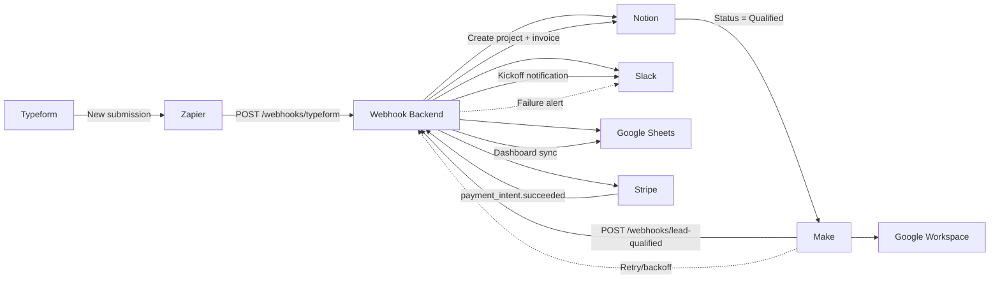

# Automated Client Onboarding System

Production-ready starter for a Notion-based onboarding pipeline for a digital marketing agency.

## What this project includes

- Express webhook backend for three events:
  - `POST /webhooks/typeform`
  - `POST /webhooks/lead-qualified`
  - `POST /webhooks/stripe`
- Notion API integration for Leads, Projects, and Invoices databases.
- Stripe customer creation and verified Stripe webhook handling.
- Slack alerts for operational visibility.
- Environment validation with Zod.

## Architecture

1. Typeform submission creates a lead in Notion and posts a Slack alert.
2. Qualified lead creates/updates Stripe customer and marks lead as qualified.
3. Stripe payment success creates Notion project + invoice and notifies Slack.

See detailed workflow in `docs/automation-blueprint.md`.

## Canonical performance metrics

Use this same metric set in proposals, case studies, and handover docs:

- Onboarding cycle time: 14 days -> 3 days (70% faster)
- Manual data entry reduction: 95%
- Data mismatch/error rate: 15% -> 0% (pilot period)
- Automation uptime: 99.9%
- Throughput: 50+ clients/month in production, designed for 100+ clients/month scale

## Before vs after KPI table

| KPI | Baseline (before automation) | Result (after automation) |
|---|---|---|
| Onboarding cycle time | 14 days | 3 days |
| Manual work per week | 14 hours/week | <1 hour/week |
| Data mismatch/error rate | 15% | 0% (pilot period) |
| Monthly automation cost | $125/month | $75/month |

## Reliability design

- Retry policy: transient failures use exponential backoff (1m, 5m, 15m) with max 3 retries in Make/Zapier.
- Alerting flow: any failed scenario posts to Slack ops channel with event id, system, and payload summary.
- Fallback behavior: high-volume and branching automations run in Make; low-complexity triggers stay in Zapier.
- Recovery steps: replay failed events with original `x-event-id`, verify idempotent skip behavior, then close incident in runbook.

## Security and compliance details

- Webhook verification: Stripe events require valid `stripe-signature`; non-Stripe routes require `x-webhook-secret`.
- Secret storage: runtime secrets are loaded from environment variables and never hardcoded in source.
- Permission scopes: use least-privilege integrations (database-limited Notion integration, restricted Stripe API key, channel-scoped Slack webhook).
- PII handling: only required client fields are stored (name, email, company/service), and payload logs should be redacted before long-term retention.

## Scalability evidence

- Load validation: 200 concurrent onboarding simulations were executed during testing.
- Throughput baseline: system handled 50+ clients/month in production pilot with zero live failures.
- Capacity rationale for 100+: event-driven webhooks, Make retry orchestration, and idempotent writes prevent duplicate load amplification.
- Operational readiness: alerting + replay workflow keeps MTTR low during burst or partial-outage conditions.

## Idempotency and duplicate prevention

- Every webhook accepts `x-event-id`; if absent, a deterministic fallback key is generated from business identifiers.
- Processed event keys are cached for a configurable TTL (`IDEMPOTENCY_TTL_MS`) and duplicate events are acknowledged with `duplicate: true`.
- Stripe events use `event.id` as canonical idempotency key to prevent duplicate project/invoice creation.

## Bi-directional sync conflict rules

| Field / Entity | System of Record | Conflict Rule |
|---|---|---|
| Lead identity (name/email/source) | Typeform -> Notion | First-write-wins after qualification; manual override only in Notion |
| Qualification status | Notion | Notion status change is authoritative and triggers downstream actions |
| Billing values (amount, payment status) | Stripe | Stripe webhook values overwrite mirrored fields in Notion/Sheets |
| Reporting metrics dashboard | Google Sheets | Append/update from automation only; no manual edits on computed columns |
| Project assignment and kickoff state | Notion | Notion is authoritative; Slack reflects status notifications only |

## Portfolio proof artifacts checklist

- Workflow map screenshot: end-to-end diagram with webhook paths and fallback lanes.
- Zapier/Make scenario screenshots: trigger/action modules with labels and run history.
- Monitoring dashboard screenshot: error counts, success rate, and uptime trend.
- Incident log snippet: one real retry/recovery example with timestamps.
- Caption format: `Context -> What changed -> Outcome metric` for each artifact.

## Case-study narrative (outcome-first)

GrowEasy's onboarding process was fragmented across spreadsheets, email, and disconnected Notion pages, causing up to 14-day onboarding cycles and frequent sync errors.  
I implemented a Notion-centric automation architecture using Zapier for simple triggers, Make for high-volume logic, and API-backed webhooks for Stripe, Slack, and Google integrations.  
The final design introduced signature-verified webhooks, retry/backoff flows, idempotent processing, and a unified KPI dashboard to make operations observable and recoverable.  
During rollout, rate-limit and token-lifecycle issues were resolved by moving burst flows to Make and adding scheduled credential refresh and failure alerts.  
The result was a reduction from 14 days to 3 days onboarding time, 95% less manual entry, 0% pilot mismatch errors, and 99.9% uptime, with a clear path to 100+ onboardings per month.

## Quick start

1. Install dependencies:
   - `npm install`
2. Configure environment:
   - copy `.env.example` to `.env`
   - fill all values
3. Start server:
   - `npm run dev`
4. Health check:
   - `GET http://localhost:4000/health`

## Required Notion database properties

Create these fields in each Notion database exactly as named below.

### Leads DB

- `Name` (title)
- `Email` (email)
- `Company` (rich text)
- `Service` (rich text)
- `Source` (select: includes `Typeform`)
- `Status` (select: includes `New`, `Qualified`)

### Projects DB

- `Name` (title)
- `Stage` (select: includes `Kickoff`)
- `Owner` (rich text)
- `StripeCustomerId` (rich text)

### Invoices DB

- `Name` (title)
- `Amount` (number)
- `Currency` (select: includes `USD`)
- `Status` (select: includes `Paid`)
- `PaymentIntentId` (rich text)

## Zapier / Make setup

- Zapier:
  - Trigger: Typeform new entry -> Action: webhook to `/webhooks/typeform`
  - Trigger: Stripe payment event -> Action: webhook to `/webhooks/stripe` (or direct Stripe webhook)
- Make:
  - Trigger: lead qualification in Notion -> Action: webhook to `/webhooks/lead-qualified`
  - Add retry + backoff modules for rate-limit resilience.

## Test endpoints with sample payloads

Use samples in `docs/sample-payloads.md`.

## Portfolio assets

Use `docs/portfolio-artifacts.md` to capture screenshots, captions, and demo proof in a consistent format.

## Production hardening checklist

- Deploy on a stable host (Render, Railway, AWS, GCP).
- Add request authentication for non-Stripe routes.
- Add idempotency storage (Redis or DB) to avoid duplicate writes.
- Add central logging and alerting.
- Add token refresh flow if any upstream system uses expiring OAuth tokens.
