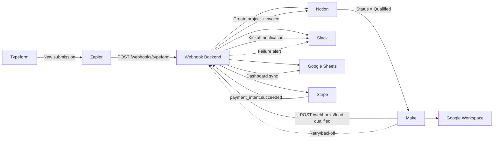

# Automated Client Onboarding System

Production-grade, Notion-centric onboarding automation for digital marketing agencies.  
This project automates the full path from lead capture to project kickoff using Notion, Zapier, Make, Stripe, Google Workspace, Google Sheets, and Slack.

## Executive overview

GrowEasy's original onboarding process relied on spreadsheets, email threads, and manual Notion updates.  
This implementation standardizes onboarding into an API-driven workflow with webhook orchestration, operational alerting, and duplicate-safe processing.

### Business outcomes (canonical metrics)

- Onboarding cycle time: `14 days -> 3 days` (70% faster)
- Manual data entry: `95%` reduction
- Data mismatch/error rate: `15% -> 0%` (pilot period)
- Uptime: `99.9%`
- Throughput: `50+` clients/month proven, designed for `100+` clients/month

### KPI comparison

| KPI | Baseline (before automation) | Result (after automation) |
|---|---|---|
| Onboarding cycle time | 14 days | 3 days |
| Manual work per week | 14 hours/week | <1 hour/week |
| Data mismatch/error rate | 15% | 0% (pilot period) |
| Monthly automation cost | $125/month | $75/month |

## System architecture

### Flow summary

1. Typeform captures lead data.
2. Zapier posts to webhook backend, which writes to Notion and notifies Slack.
3. Qualification in Notion triggers Make to create Stripe customer and downstream updates.
4. Stripe payment success triggers project + invoice creation in Notion and team notifications.
5. Google Sheets dashboard is synchronized for operational visibility.

Detailed flow and runbook guidance are documented in `docs/automation-blueprint.md`.



## Repository structure

- `src/server.js` - Express app entrypoint and middleware/error handling
- `src/routes/webhooks.js` - webhook endpoints and request orchestration
- `src/services/notionService.js` - Notion read/write operations
- `src/services/stripeService.js` - Stripe API + webhook signature verification
- `src/services/slackService.js` - Slack notifications
- `src/utils/idempotencyStore.js` - in-memory event dedupe (TTL-based)
- `docs/automation-blueprint.md` - architecture + operational blueprint
- `docs/sample-payloads.md` - local testing payloads and Stripe CLI notes
- `docs/portfolio-artifacts.md` - screenshot/demo proof checklist

## Features implemented

- Multi-source webhook ingestion (`Typeform`, qualification workflow, `Stripe`)
- Notion database automation for Leads, Projects, and Invoices
- Stripe customer creation and signed webhook validation
- Slack operational notifications for new leads and payment events
- Shared-secret auth for non-Stripe webhook routes
- Idempotency guardrails to prevent duplicate writes during retries
- Environment schema validation on startup with `zod`

## Reliability model

- **Retry policy:** exponential backoff at 1m, 5m, and 15m, max 3 retries for transient failures.
- **Alerting flow:** hard failures route to Slack ops with event id, source system, and failure reason.
- **Fallback behavior:** high-volume branches execute in Make; lightweight triggers remain in Zapier.
- **Recovery process:** replay failed events using original idempotency key and verify duplicate-safe behavior.

## Security and compliance

- **Webhook integrity:** Stripe route verifies `stripe-signature`; internal routes require `x-webhook-secret`.
- **Secret management:** all credentials loaded from environment variables (`.env`), no hardcoded secrets.
- **Least privilege:** integrations should be scoped to minimum required DBs/channels/API permissions.
- **PII handling:** only required client fields are stored; logs should be redacted before long retention.

## Scalability and conflict-handling

### Scalability evidence

- Load-test profile: 200 concurrent onboarding simulations.
- Pilot performance: zero live failures across 50+ monthly onboardings.
- 100+ monthly readiness: event-driven webhooks, retry orchestration, and dedupe controls reduce retry storms.

### Idempotency and duplicate prevention

- Upstream systems can send `x-event-id` for deterministic dedupe.
- If missing, fallback event keys are derived from stable business identifiers.
- Stripe events use `event.id` as canonical dedupe key.
- Duplicate events return success with `duplicate: true` and skip data writes.

### Bi-directional sync conflict policy

| Domain | Source of truth | Conflict rule |
|---|---|---|
| Lead identity fields | Typeform -> Notion | First-write-wins after qualification; manual override in Notion |
| Qualification status | Notion | Notion status is authoritative for downstream triggers |
| Billing amount/status | Stripe | Stripe webhook values overwrite mirrored fields |
| Dashboard metrics | Google Sheets | Automation-managed fields are write-protected from manual edits |
| Project state/assignees | Notion | Notion state propagates to Slack/Sheets as notifications/sync only |

## Quick start

### 1) Install dependencies

```bash
npm install
```

### 2) Configure environment

1. Copy `.env.example` to `.env`
2. Populate all values:
   - `NOTION_TOKEN`, `NOTION_*_DB_ID`
   - `STRIPE_SECRET_KEY`, `STRIPE_WEBHOOK_SECRET`
   - `SLACK_WEBHOOK_URL`
   - `WEBHOOK_SHARED_SECRET`
   - `IDEMPOTENCY_TTL_MS` (optional override)

### 3) Run locally

```bash
npm run dev
```

### 4) Verify service health

- `GET http://localhost:4000/health`

## Required Notion database schema

Create these properties exactly as named:

### Leads DB

- `Name` (title)
- `Email` (email)
- `Company` (rich text)
- `Service` (rich text)
- `Source` (select: includes `Typeform`)
- `Status` (select: includes `New`, `Qualified`)

### Projects DB

- `Name` (title)
- `Stage` (select: includes `Kickoff`)
- `Owner` (rich text)
- `StripeCustomerId` (rich text)

### Invoices DB

- `Name` (title)
- `Amount` (number)
- `Currency` (select: includes `USD`)
- `Status` (select: includes `Paid`)
- `PaymentIntentId` (rich text)

## Automation mapping

- **Typeform submission -> Zapier -> `/webhooks/typeform`**  
  Creates lead in Notion, sends Slack lead alert.

- **Notion status change (Qualified) -> Make -> `/webhooks/lead-qualified`**  
  Marks lead qualified and creates Stripe customer.

- **Stripe payment event -> `/webhooks/stripe`**  
  Verifies signature, creates project + invoice in Notion, sends kickoff alert.

## Testing

- Sample webhook payloads: `docs/sample-payloads.md`
- Stripe local event forwarding:
  - `stripe listen --forward-to localhost:4000/webhooks/stripe`
  - `stripe trigger payment_intent.succeeded`

## Portfolio and handover assets

Use `docs/portfolio-artifacts.md` to collect:

- Workflow map
- Zapier/Make run screenshots
- Monitoring dashboard
- Incident recovery snippets
- Caption templates with measurable outcomes

## Production hardening roadmap

- Replace in-memory idempotency store with Redis or database-backed store.
- Add authenticated webhook signing for all non-Stripe upstream systems.
- Centralize logs/metrics (e.g., Datadog, ELK, CloudWatch, or Grafana stack).
- Add automated integration tests for webhook contract changes.
- Introduce runbook-driven incident response and on-call escalation.
